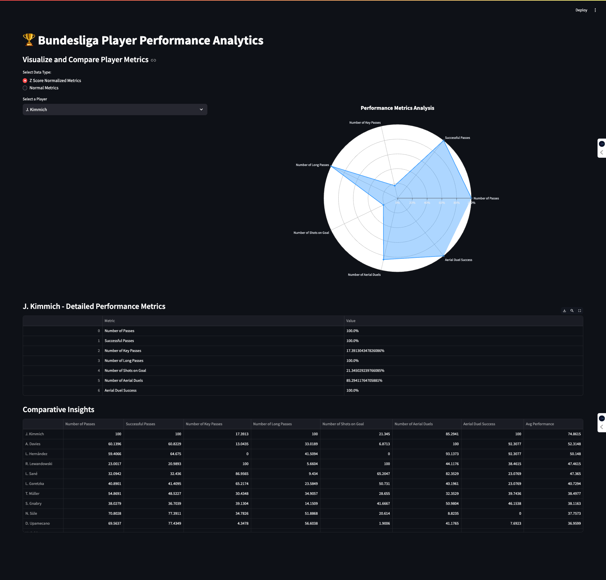

# Live Streamlit Dashboard




## Introduction

This project is a live dashboard built using Streamlit and Python. It provides real-time data visualization and analytics, making it easy to monitor and analyze data on the fly.

## Getting Started

Follow the instructions below to get a copy of the project up and running on your local machine for development and testing purposes.

### Prerequisites

Make sure you have the following installed:

- Python 3.11 or higher
- pip (Python package installer)
- Jupyter Notebook
- Docker
- Docker-Compose

### Installation

1. Clone the repository:

   ```sh
   git clone git@github.com:saudBinHabib/analysis_dashboards.git
   cd fcb_data_analytics
   ```

2. Install the required packages:

   ```sh
   You need to make sure that, you have docker, and docker-compose installed.
   ```

## 📊 Features

### Data Processing

- Custom Python package for match data processing
- Efficient event data extraction
- FastApi implementation of the metrics, So you can use those metrics, for otehr Dashboards
- Streamlit implementation of the Radar Chart
- Dockerise solution
- Docker-compose run all the applications.

## 🛠 Tech Stack

### Backend

- Python 3.11+
- FastAPI
- StreamLit
- PostgreSQL
- SQLAlchemy
- Pydantic
- Pandas
- Logging
- Docker
- Docker Compose
- pre-commit hooks

## Using `docker-compose` package

```sh

    # Running docker compose file
    docker-compose up

    # You can access the fastapi on the following URL
    http://localhost:8000/

    # Now you need to initialize the data processing, for which you need to store event, and stats related files in the root level data directory.
    cp -r data_dir/ data/

    # Now you can run the custom_package to get the data, you need to use the following URL
    http://localhost:8000/process_data

    # This will store the data, in the database, now you can use the fastapi, and streamlit, now when the data is stored in the database.

    #FastApi documentation, and usage can be seen on this URL.
    http://localhost:8000/docs

    # You can use the streamlit application on the following link.
    http://localhost:8501/

    # In the Streamlit dashboard, you can see either z-score normalize data for each player on various metrics to do scaling of the data on various metrics, Or you can use normal metrics for seeing actual value of the metrics.

    # The Dashboard is configured in such a way that you can choose individual player, and then see the performance of that player on a radar chart.


```

## Data Exploration Using Jupyter Notebooks

The `notebooks` directory contains Jupyter Notebooks for data exploration. To start exploring the data, follow these steps:

1. Navigate to the `notebooks` directory:

   ```sh
   cd notebooks
   ```

2. Create Jupyter Notebook:

   ```sh
   touch data-exploration.ipynb
   ```

3. Open any of the notebooks to start exploring the data.

## Contributing

If you would like to contribute to this project, please fork the repository and submit a pull request. We welcome all contributions!

## 📄 License

This project is licensed under the MIT License - see the LICENSE file for details.

## 📧 Contact

    For questions and support, please contact:

    Project Maintainer: Saud Bin Habib
    Technical Support: saud.bin.habib@outlook.com

Made with ⚽️ for FC Bayern Munich
